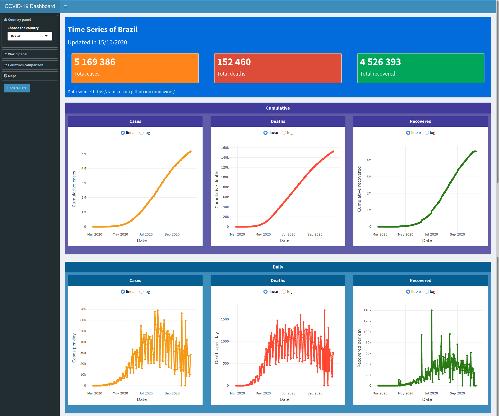

# Covid-19 Evolution Dashboard

### Dashboard url:
https://rafael747cardoso.shinyapps.io/Covid19_Dashboard/

Here you will see a panel of the confirmed cases of the Covid-19 global pandemic made with R and Shiny.
The data is updated nearly daily from the data source.
To update the data from the API, click "Update Data" and refresh the webpage.

#### Covid-19 data source:
https://ramikrispin.github.io/coronavirus/

### Screens:

